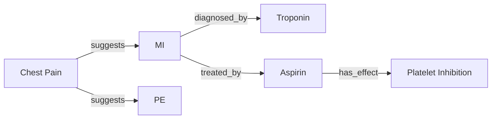

# Reasoning Core 🧠

**Universal reasoning extraction engine for building intelligent knowledge graphs from any domain**

[](https://www.python.org/downloads/)
[](https://opensource.org/licenses/MIT)

---

## 🌟 What is Reasoning Core?

Reasoning Core is a domain-agnostic library that extracts **reasoning patterns** and builds **knowledge graphs** from text, lectures, meetings, or any content. It goes beyond simple transcription or summarization—it captures *how experts think* and connects ideas the way humans naturally reason.

### The Problem

Traditional tools capture *what* is said (transcription) or *summarize* content, but they miss the most valuable part: **how concepts connect and how experts reason through problems**.

### The Solution

Reasoning Core:
- 🧩 **Extracts concepts** (entities, ideas, terms)
- 🔗 **Maps relationships** (causes, treats, requires, etc.)
- 🧠 **Builds reasoning chains** (A → B → C → D)
- 📊 **Creates knowledge graphs** (visual concept maps)
- ❓ **Generates questions** (test understanding)
- 🔄 **Cross-references** (links to prior knowledge)

---

## 🎯 Use Cases

### Medical Education
- Clinical reasoning chains (symptoms → diagnosis → treatment)
- Pathophysiology connections
- Pharmacology relationships
- **Powers: [COGNISCRIBE](https://github.com/Excelsior2026/COGNISCRIBE)**

### Business Training
- Sales process workflows
- Objection handling patterns
- Value proposition mapping
- Strategic frameworks

### Legal/Compliance
- Case law precedents
- Regulatory requirement chains
- Compliance workflows

### Engineering
- System architecture relationships
- Debugging reasoning patterns
- Design decision trees

### General Education
- Any subject with conceptual relationships
- Multi-domain learning support

---

## 🚀 Quick Start

### Installation

```bash
pip install reasoning-core
```

### Basic Usage

```python
from reasoning_core.domains.medical_domain import MedicalDomain

# Initialize domain
domain = MedicalDomain()

# Analyze text
text = """
Patient presents with chest pain and dyspnea. 
We should consider MI, PE, or pneumonia in the differential.
Order ECG, troponin, and D-dimer. If troponin elevated, 
treat with aspirin and heparin.
"""

# Extract concepts
concepts = domain.extract_concepts(text)
print(f"Found {len(concepts)} concepts")

# Identify relationships
relationships = domain.identify_relationships(concepts)
print(f"Found {len(relationships)} relationships")

# Build reasoning chains
chains = domain.build_reasoning_chains(concepts, relationships)
print(f"Identified {len(chains)} reasoning patterns")

# Generate questions
questions = domain.generate_questions(concepts, chains)
for q in questions:
    print(f"❓ {q}")
```

---

## 🏗️ Architecture

### Domain Plugin System

```python
from reasoning_core.domains.base_domain import BaseDomain

class MyCustomDomain(BaseDomain):
    def get_domain_name(self) -> str:
        return "my_domain"
    
    def get_terminology_mapping(self) -> Dict[str, List[str]]:
        return {
            "concept_type_1": ["term1", "term2"],
            "concept_type_2": ["term3", "term4"],
        }
    
    def get_reasoning_patterns(self) -> List[ReasoningPattern]:
        return [
            ReasoningPattern(
                name="pattern_name",
                description="Pattern description",
                steps=["step1", "step2", "step3"],
            )
        ]
    
    # Implement other abstract methods...
```

### Built-in Domains

- **Medical** (`MedicalDomain`) - Clinical reasoning, pathophysiology
- **Business** (`BusinessDomain`) - Sales, strategy, frameworks
- **Custom** - Easy to extend!

---

## 📦 Components

### Core Modules

```
reasoning-core/
├── domains/              # Domain plugins
│   ├── base_domain.py   # Abstract base
│   ├── medical_domain.py
│   └── business_domain.py
├── extractors/          # Concept & relationship extraction
├── graph/               # Knowledge graph builder
├── chains/              # Reasoning chain analyzer
└── api/                 # Public API
```

### Key Classes

- **`BaseDomain`** - Abstract base for all domains
- **`Concept`** - Represents extracted concepts
- **`Relationship`** - Represents concept relationships
- **`ReasoningPattern`** - Domain reasoning patterns
- **`KnowledgeGraph`** - Graph structure
- **`ReasoningChain`** - Ordered concept sequences

---

## 🎓 Concepts

### Reasoning Chains

A **reasoning chain** is an ordered sequence of concepts showing how an expert thinks:

```
Medical Example:
Symptom (chest pain) 
  → Differential (MI, PE, pneumonia)
  → Workup (ECG, troponin, D-dimer)
  → Diagnosis (MI)
  → Treatment (aspirin, heparin)

Business Example:
Pain point (high costs)
  → Solution (automation)
  → Benefit (time savings)
  → Value (cost reduction)
  → ROI (50% savings)
```

### Knowledge Graphs

Visual representation of concepts and relationships:



---

## 🛠️ Development

### Setup

```bash
git clone https://github.com/Excelsior2026/reasoning-core.git
cd reasoning-core
python -m venv .venv
source .venv/bin/activate
pip install -e ".[dev]"
```

### Testing

```bash
pytest
pytest --cov=src
```

### Creating a Custom Domain

1. Subclass `BaseDomain`
2. Implement required methods
3. Define terminology and patterns
4. Test with sample content

See `medical_domain.py` and `business_domain.py` for examples.

---

## 🌐 Products Using Reasoning Core

- **[COGNISCRIBE](https://github.com/Excelsior2026/COGNISCRIBE)** - Medical education transcription with reasoning extraction
- **REASONMAP** - Multi-domain enterprise platform (coming soon)

---

## 🤝 Contributing

Contributions welcome! Areas of interest:
- New domain plugins (legal, engineering, science, etc.)
- Improved NER models
- LLM integration for relationship extraction
- Graph visualization tools
- Performance optimizations

See [CONTRIBUTING.md](CONTRIBUTING.md) for guidelines.

---

## 📄 License

MIT License - See [LICENSE](LICENSE) for details.

---

## 🙏 Acknowledgments

Built on the shoulders of:
- Domain-driven design principles
- Knowledge graph research
- Clinical reasoning methodologies
- Modern LLM capabilities

---

**Transform content into intelligence. Extract reasoning. Build knowledge.**

*Made with ❤️ for learners, educators, and knowledge workers everywhere.*
